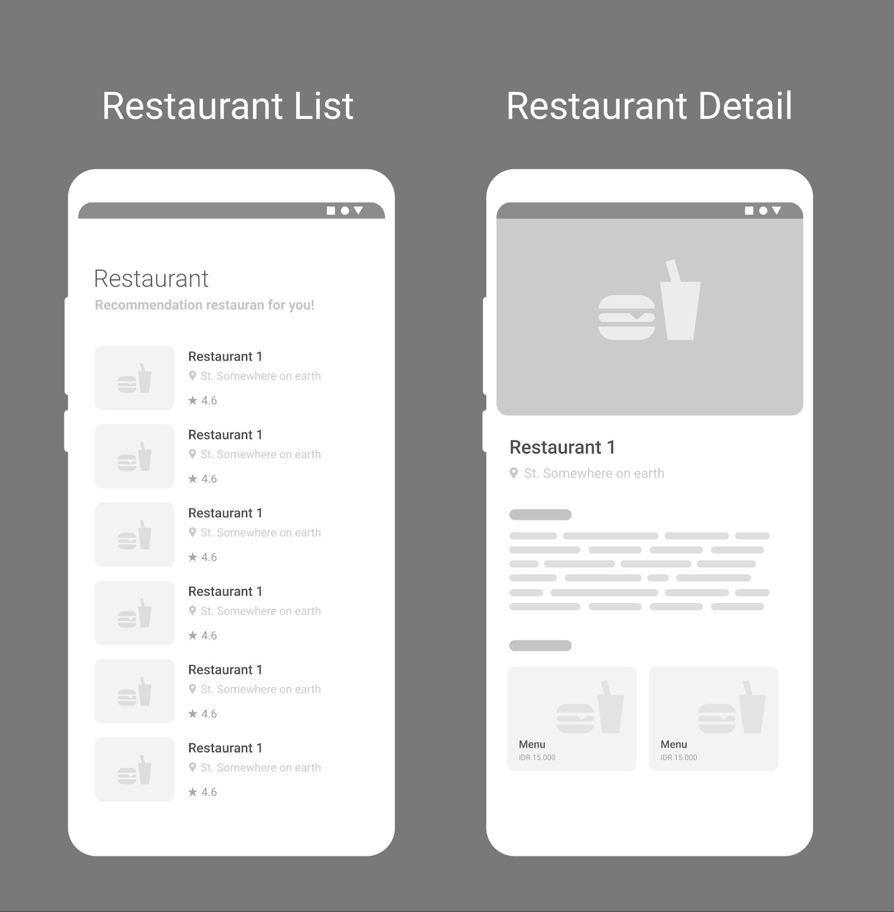

# Proyek 1: Restaurant App dengan API

Dalam mengerjakan proyek/submission ini, ada beberapa kriteria wajib yang perlu Anda penuhi. Seluruh kriteria ini diperlukan agar Anda dapat melanjutkan pengerjaan di submission akhir. Berikut adalah daftar kriteria dari submission ini.

1. **Halaman Daftar Restoran**

- Membuat satu halaman berisi daftar restoran.
- Informasi daftar restoran didapat dari API.
- Menampilkan item yang mencakup informasi minimal, seperti nama, gambar kota, dan rating restoran. 

2. **Halaman Detail Restoran**

- Membuat satu halaman berisi detail restoran.
- Informasi detail restoran didapat dari API.
- Menampilkan informasi restoran, seperti nama, gambar, deskripsi, kota, alamat, rating, menu makanan, dan minuman.

3. **Mengganti Tema Default**

- Menambahkan tema terang dan gelap.
- Mengubah default font type.
- Mengubah warna pada tema selain warna default aplikasi.

4. **Indikator Loading**

- Terdapat indikator loading untuk setiap proses pemanggilan API.
- Indikator loading dapat berupa widget 
CircularProgressIndicator, gambar, ataupun animasi tertentu, seperti Lottie dan Rive.

5. **Menggunakan State Management**

- Menggunakan library state management Provider.
- Cukup menggunakan satu state management untuk mengelola state.
- Manfaatkan sealed class, khususnya pada saat memanggil Web API.

Berikut kerangka tampilan yang bisa Anda gunakan sebagai referensi.

